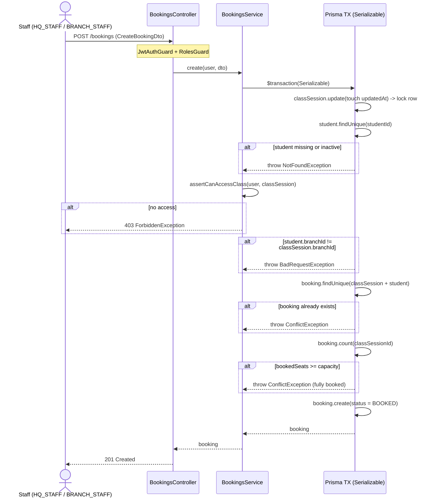
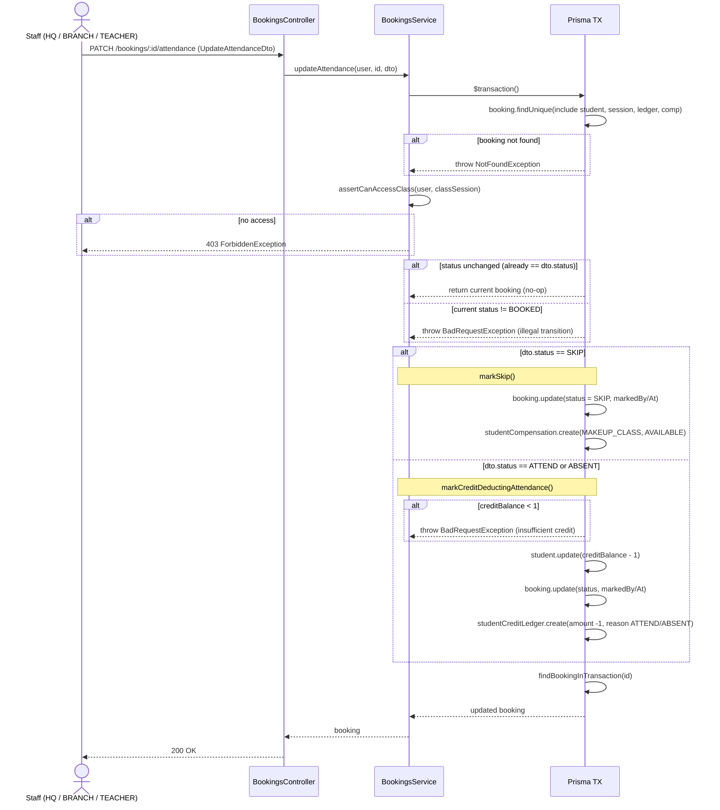

# Bookings Service — Sequence Diagrams

Source: `src/modules/bookings/bookings.service.ts`

## 1. Create booking — `POST /bookings`

## 2. Update attendance — `PATCH /bookings/:id/attendance`

## Notes

- **Create** runs at `Serializable` isolation and touches the `classSession` row first to guard the capacity check against concurrent bookings.
- **Attendance** only transitions out of `BOOKED`; it is an idempotent no-op when the status already matches.
- `SKIP` issues a makeup-class compensation; `ATTEND` / `ABSENT` deduct 1 credit and write a credit-ledger entry.
